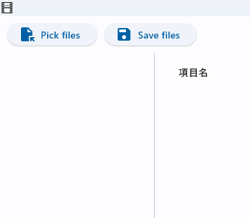
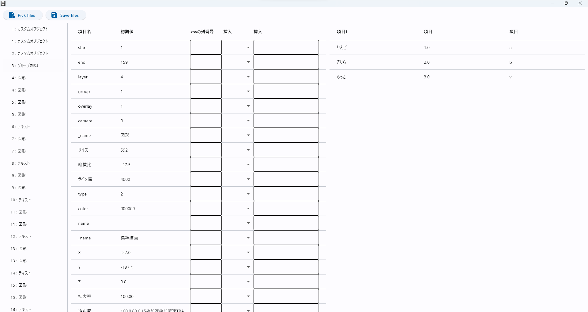

# このソフトでできること
- オブジェクトを重ねて配置
- .csvの内容を反映させる

[紹介動画はこちら](https://youtu.be/TX44BRiEc9s?si=CB8sjIkAvQBBexry)

# ダウンロードについて

ダウンロードするときに、windows difenderやブラウザのセキュリティが反応します。このソフトをダウンロード、実行したときに生じた損害については当方は一切責任を負いません。もちろん主となる機能以外に何か実行するようにプログラムはしていません。

# 使いかた
## ファイルを開く
左上のpick filesからcsvファイルとexoファイルを開きます。
.csvファイルにはヘッダー(1行目に書く列の名前)があるように見なしているので、もしヘッダーがない場合は、なんでもいいので一番上に1行追加してください。

## 書き換える箇所を入力する
開くと下図のようになります。

### 各要素について
- 上部　読み込みと書き出し
- 左　exoファイルの各要素(layer番号:オブジェクト名です。)
- 中央左　書き換える画面
  - 項目名　exoファイルでの保存名
  - 初期値　保存されている値(textはバイナリのため変換しています。)
  - 入力欄　ここから変更します。
- 右　csvのプレビュー　csvの一部を見ることができます。

### 入力方法

- (X,.csvの列番号)に2を入力すると、csvファイルの行数分(例では3回)繰り返され、各回のXにはそれぞれ1.0,2.0,3.0が入ります。
- 挿入は数字、文字(textのみ)を選択できます。
  - 通常通り入力するとすべてが置き換わります。
  - それぞれ{number}、{text}は、元の値または入れ替えた値として扱います。入力例は以下の通りです。
    - 世界の{text}を集めました。
      - textの.csvの列番号に1を入力すると例えば「世界のリンゴを集めました」となります
    - (5*{number})+6
      - Xの.csvの列番号に2を入力すると例えば11.0になります
  - 数字の場合 "0-9 +-/* () . {number}"のみ使用可能です。

### ショートカット

- enter 下に移動
- shift + enter 1つ下のオブジェクトに移動

## 出力する

左上のsave filesから書き出すことができます。
start,endは何も指定しないとぴったり重なります。

### 注意事項
- 書き換え方によっては読み込めなくなるので、書き換え方が分からない場合はaviutlで書き換えてexo出力し、両者を比べてみるのがいいでしょう。(メモ帳などからテキストとして開けます。)
- 途中で保存するようなことは想定していないので、挿入はできるだけ使わず、csvファイルを編集するようにしましょう。

